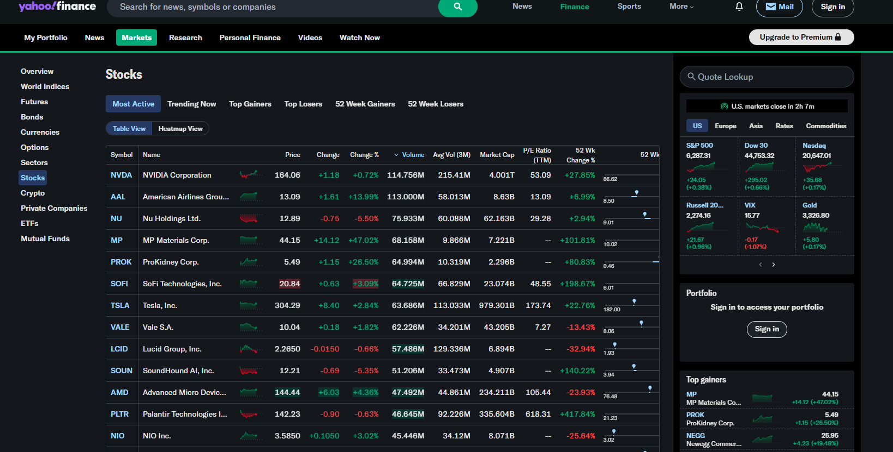

# Stock Portfolio Tracker
Live Stock Portfolio Monitor with Real-Time Trade Simulation &amp; Visual Analytics

## Overview
1. Tracks a simulated investment portfolio using live or historical stock data.
2. Simulates buy/sell transactions in real time using a Python script.
3. Stores trade and stock data in a SQLite database.
4. Visualizes performance and transaction activity using Tableau and Excel.
5. Includes calculated metrics: portfolio value, gain/loss, ROI, and sector exposure.

### Tools and Development Tools and Environment
- Python
- SQLite (via sqlite3 python package)
- Tableau
- Excel
- Jupyter Notebook

### Python Libraries (use bash to install)
- yfinance
- pandas
- matplotlib
- sqlalchemy
- openpyxl  

### Layout

```
fintech-project/
├── data/
│   ├── sim_database.db
│   ├── stock_data.csv
├── scripts/
│   ├── setup_database.py
│   ├── fetch_stock_data.py
│   ├── simulate_trades.py
│   ├── portfolio_tracker.py
├── outputs/
│   ├── portfolio_summary.xlsx
│   └── dashboard.twbx
├── README.md
```

## Timeline
### Week 1
Goal: Make static stock portfolio tracker with Python and SQLite   
Tasks:   
- [X] Design portfolio schema: trades, holdings, stock_prices  
- [X] Use yfinance to pull historical price data
    - Example: Top 20 Most Active Stocks from Yahoo finance

- [X] Populate SQLite database with stock prices and sample trades
- [ ] Calculate performance metrics: unrealized gains, ROI, CAGR
- [ ] Export summary to Excel
- [ ] Create initial Tableau dashboard: portfolio value over time, allocation by sector  
---------
### Week 2
Goal: Simulate trades being added in real-time and update the dashboard  
Tasks:  
- [ ] Write a Python script to simulate trades every 10 seconds (buy/sell using Faker)  
- [X] Append trades to the trades table  
- [X] Periodically pull new prices from yfinance (or simulate price updates)  
- [ ] Recalculate holdings and portfolio value every N minutes  
- [ ] Update Tableau dashboard with auto-refresh or periodic export  
---------
### Week 3
Goal: Finalize insights  
Tasks:
- [ ] Add derived metrics (e.g. Sharpe ratio, max drawdown)  
- [ ] Create Excel reports with charts + pivot tables  
- [ ] Add interactivity to Tableau (e.g. filter by ticker or sector)  
- [ ] Publish Tableau dashboard (Public) or record a demo
